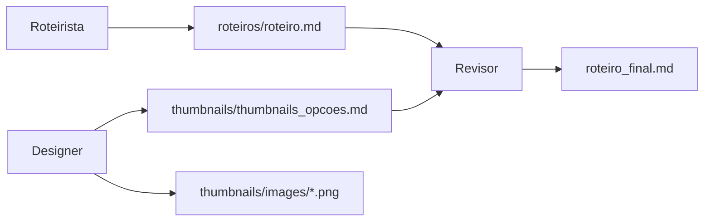

# 📂 Pasta de Resultados (Outputs)

Esta pasta armazena todos os **resultados gerados** pelo sistema de criação de conteúdo para YouTube Gaming.

---

## 🗂️ Estrutura de Arquivos

### **📝 `/roteiros/`**
Contém os roteiros de vídeos gerados pelo agente **Roteirista**.

**Arquivos gerados:**
- `roteiro.md` - Roteiro completo estruturado (Introdução, Tema Principal, Conclusão)
- `roteiro_[timestamp].md` - Versões com timestamp para histórico

**Formato:**
```markdown
# Roteiro: [Título do Vídeo]

## [00:00-00:30] Introdução
[texto]

## [00:30-02:00] Tema Principal
[texto]

## [02:00-02:30] Conclusão
[texto]
```

---

### **🎨 `/thumbnails/`**
Contém as opções de thumbnails geradas pelo agente **Designer**.

**Arquivos gerados:**
- `thumbnails_opcoes.md` - Documento com 3 opções de thumbnails + análise
- `thumbnails_[timestamp].md` - Versões com timestamp

**Subpasta `/images/`:**
- Imagens PNG geradas pelo DALL-E 3
- Nomenclatura: `thumbnail_[descricao]_[timestamp].png`
- Resolução: 1792x1024 (próximo de 16:9 do YouTube)

**Exemplo:**
```
thumbnails/
├── thumbnails_opcoes.md
└── images/
    ├── thumbnail_vibrante_20241230_153022.png
    ├── thumbnail_escuro_20241230_153045.png
    └── thumbnail_minimalista_20241230_153108.png
```

---

### **📄 `/roteiro_final.md`**
Documento final integrado gerado pelo agente **Revisor**.

**Conteúdo:**
- Roteiro revisado e otimizado
- 3 opções de thumbnails incorporadas
- Recomendação de thumbnail
- Metadados do vídeo (título, descrição, tags)
- Otimização SEO para YouTube

---

## 🔄 Fluxo de Geração



---

## 📊 Exemplos de Uso

### **Visualizar roteiro gerado:**
```bash
cat outputs/roteiros/roteiro.md
```

### **Visualizar thumbnails:**
```bash
cat outputs/thumbnails/thumbnails_opcoes.md
```

### **Ver resultado final:**
```bash
cat outputs/roteiro_final.md
```

### **Abrir imagens:**
```bash
start outputs/thumbnails/images/
```

---

## 🧹 Limpeza

Para limpar resultados antigos:

```bash
# Windows
del /Q outputs\roteiros\*.md
del /Q outputs\thumbnails\*.md
del /Q outputs\thumbnails\images\*.png
del /Q outputs\*.md

# Linux/Mac
rm -f outputs/roteiros/*.md
rm -f outputs/thumbnails/*.md
rm -f outputs/thumbnails/images/*.png
rm -f outputs/*.md
```

---

## ⚠️ Importante

- **Não commitar arquivos gerados** no Git (apenas a estrutura)
- Adicionar `*.md` e `*.png` no `.gitignore` desta pasta
- Manter apenas os arquivos `.gitkeep` e `README.md` no repositório

---

## 📝 Formato dos Arquivos

Todos os arquivos são gerados em **Markdown** (.md) para:
- ✅ Fácil leitura e edição
- ✅ Compatibilidade com GitHub/GitLab
- ✅ Conversão para outros formatos (PDF, HTML)
- ✅ Versionamento eficiente

---

## 🎯 Status

- [x] Estrutura de pastas criada
- [x] Documentação completa
- [x] .gitkeep em todas as pastas
- [ ] Aguardando primeira execução do sistema

---

**Última atualização:** 30/12/2024